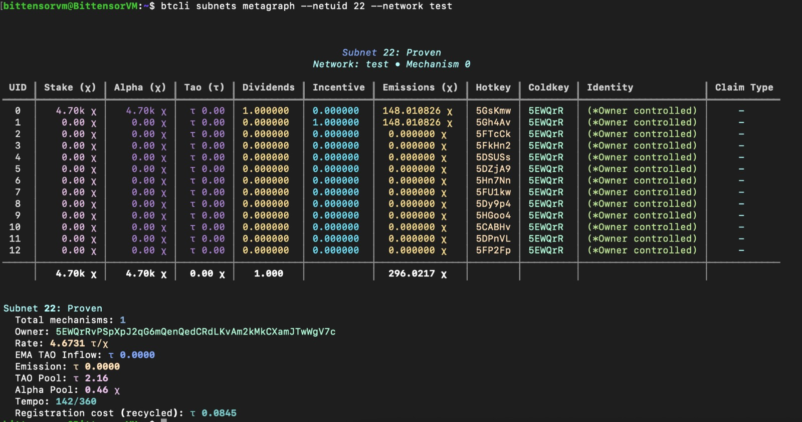

# Proven Workspace



## Testnet Status

Proven is built and running on Bittensor testnet, with the current workspace covering the subnet code, Docker fixtures, frontend, and operating docs used for the live pitch environment.

Proven is a Bittensor subnet project focused on spec-driven software verification. This workspace contains the subnet implementation, local chain dependencies, Docker fixtures, and project documentation used to develop and test the subnet.

## Start Here

- Main subnet code: [`proven-subnet/README.md`](./proven-subnet/README.md)
- Docs index: [`proven-subnet/docs/README.md`](./proven-subnet/docs/README.md)
- Local setup: [`proven-subnet/docs/setup/localnet.md`](./proven-subnet/docs/setup/localnet.md)
- Testnet setup: [`proven-subnet/docs/setup/testnet.md`](./proven-subnet/docs/setup/testnet.md)
- Mainnet setup: [`proven-subnet/docs/setup/mainnet.md`](./proven-subnet/docs/setup/mainnet.md)
- Project roadmap: [`proven-subnet/docs/project/roadmap.md`](./proven-subnet/docs/project/roadmap.md)
- Subnet spec template: [`proven-subnet/docs/project/subnet-spec.md`](./proven-subnet/docs/project/subnet-spec.md)

## Workspace Layout

```text
proven-todo/
├── proven-subnet/         # Main Proven subnet codebase
│   ├── neurons/           # Miner and validator entrypoints
│   ├── template/          # Shared subnet scaffolding and config
│   ├── docker/            # Reference and mutant web-app fixtures
│   ├── running-scripts/   # Localnet bootstrap helpers
│   ├── docs/              # Setup, tutorials, and project docs
│   └── tests/             # Python test suite
├── subtensor/             # Local chain source used for local development
└── venv/                  # Local Python environment (ignored)
```

## Current Prototype

The current repo implements a working prototype of the subnet loop:

- Miners receive a verification task and return a Playwright-style Python test script.
- Validators syntax-check and execute the script against a clean fixture app and a mutant fixture app.
- Docker fixtures live in `proven-subnet/docker/reference` and `proven-subnet/docker/mutant`.
- Local bootstrap scripts live in `proven-subnet/running-scripts/`.

The validator currently depends on local services at `localhost:8080` and `localhost:8081`, so the Docker fixtures need to be running for end-to-end validation.

## Security Notes

- Never commit wallets, mnemonics, private keys, or `.env` files.
- Keep coldkey private material off miners, validators, and VPS nodes.
- Keep validator fixture ports (`8080` and `8081`) bound to localhost unless you intentionally want them public.
- Treat `scripts/install_staging.sh` as disposable localnet automation, not production deployment guidance.

## Repo Hygiene Improvements

This workspace now uses a top-level `.gitignore` for local environments and OS/editor noise. If you add new tooling, extend that file before committing generated state.

## Authors

- Theo Justin Amantha
- Christopher Hardy Gunawan
- Roderich Cavine Chow
